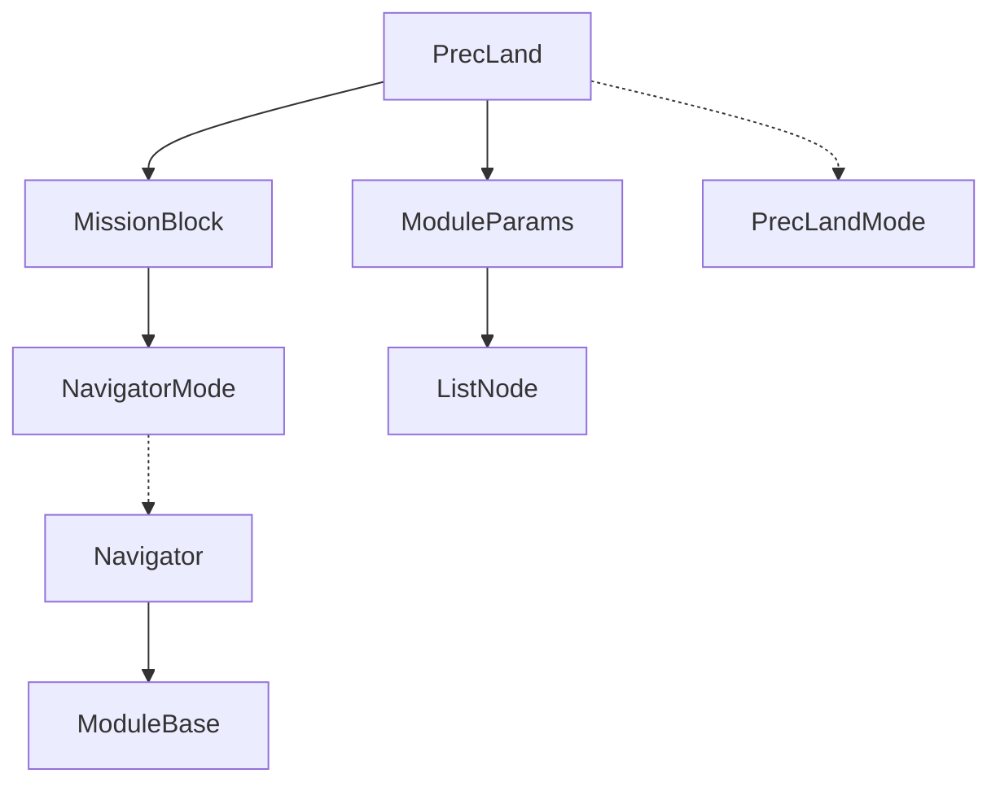

### 交叉项目综合训练 Pixhawk&MAVROS
<div align="center" style="font-family:yahei">自92 刘康城</div>

#### Week0
前期工作
+ 安装双系统教程 https://www.cnblogs.com/masbay/p/11627727.html
+ ubuntu 美化
  + Ubuntu18.04美化总结 https://www.jianshu.com/p/6ef16e3b0a3e
  + 墙纸网站 https://wall.alphacoders.com/?lang=Chinese

本文配置均为从零开始

#### Week1
配置 `PX4` 仿真环境，实现仿真程序与 `QGC` 联动
https://docs.px4.io/master/en/dev_setup/getting_started
QGC Download :
https://docs.qgroundcontrol.com/master/en/getting_started/download_and_install

本周需要完成 `Toolchain Installation`&`Building the Code`两部分
Tips：鉴于中文版翻译混乱，推荐使用英文版 Guide
Tips：如果遇到 `github` 访问慢的问题可以按照以下方法使用代理网站
如将
`git clone https://github.com/PX4/avoidance.git`
改为
`git clone https://ghproxy.com/https://github.com/PX4/avoidance.git`
具体使用方法请访问网站官网 https://ghproxy.com/
Tips：如果遇到 `rosdep update` 命令出现错误
```
    $ sudo rosdep init
    ERROR: cannot download default sources list from:
    https://raw.githubusercontent.com/ros/rosdistro/master/rosdep/sources.list.d/20-default.list
    Website may be down.
```
可以采用以下文章的方法 https://zhuanlan.zhihu.com/p/392082731
注意不要遗漏文件，亲侧有效。

#### Week2
配置 `PX4` 避障仿真环境
https://github.com/PX4/PX4-Avoidance
教程基本没有大坑，最好按照教程**一样的**文件路径来配置，不然容易出错。
需要注意的是，每次运行避障程序仿真前都需要重新在终端中配置好环境变量，目前已知以下几行代码一定要提前运行一下：
```
    # This is necessary to prevent some Qt-related errors (feel free to try to omit it)
    export QT_X11_NO_MITSHM=1

    # Build and run simulation
    make px4_sitl_default gazebo

    # Quit the simulation (Ctrl+C)

    # Setup some more Gazebo-related environment variables
    # (modify this line based on the location of the Firmware folder on your machine)
    . ~/Firmware/Tools/setup_gazebo.bash ~/Firmware ~/Firmware/build/px4_sitl_default

    export ROS_PACKAGE_PATH=${ROS_PACKAGE_PATH}:~/Firmware
```

#### Week3
学习 `PX4` 控制程序的开发方法
https://docs.px4.io/master/en/dev_setup/getting_started.html
本周完成 `Writing your First Application`&`Application/Module Template`
没有任何问题，如果实在有问题就看看别人的 example 怎么写的，粘贴一个一样的编译看看
阅读以下部分关于精准降落算法实现的内容
https://docs.px4.io/master/en/advanced_features/precland.html
看一下相关的代码

#### Week4
了解 PX4 系统的软件架构
+ Flight Controller (only)
+ FC and Companion Computer

**High-Level Software Architecture**


[precision landing](https://github.com/PX4/PX4-Autopilot/tree/master/src/modules/navigator)

#### Week5
[Pixhawk系统架构介绍](https://blog.csdn.net/u013181595/article/details/80976610)
[PX4/Pixhawk---uORB深入理解和应用](https://blog.csdn.net/freeape/article/details/46880637)
[PX4硬件 Consoles 通讯](https://docs.px4.io/master/en/debug/mavlink_shell.html)

```bash
cd PX4-Autopilot
./Tools/mavlink_shell.py /dev/ttyACM0
```

#### Week6

